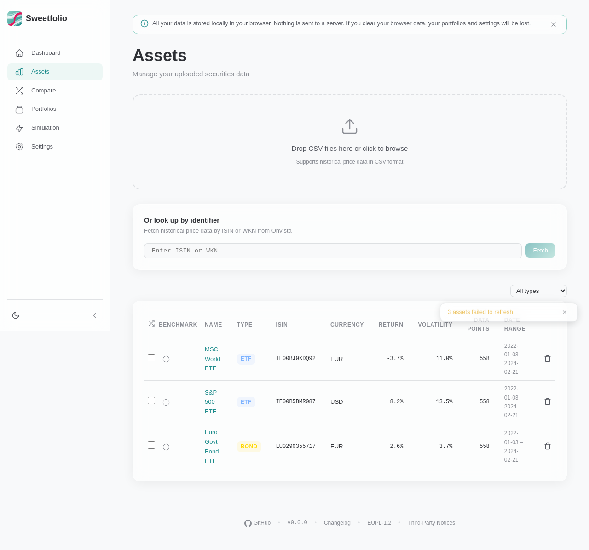
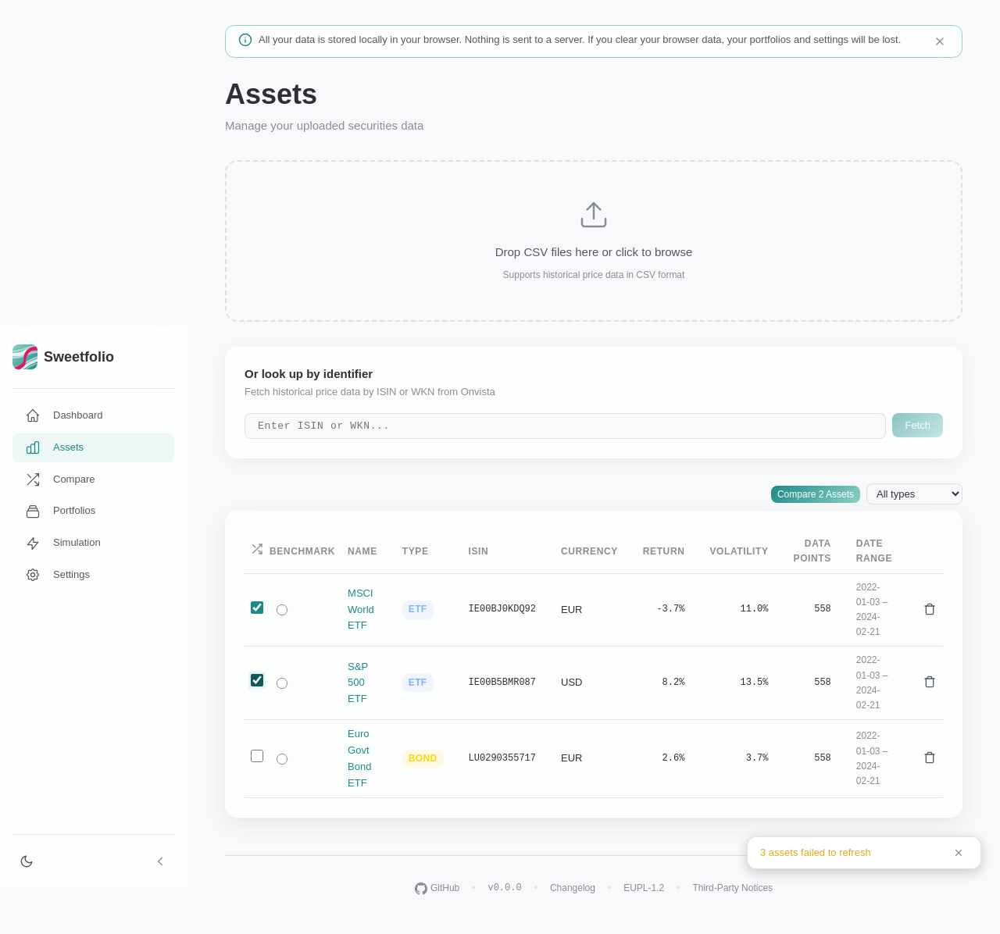
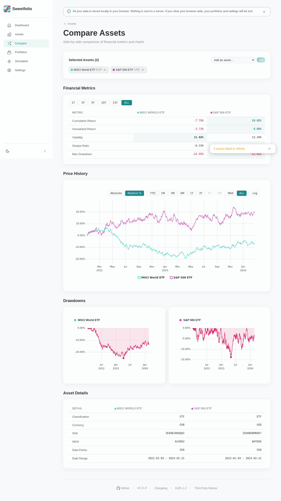
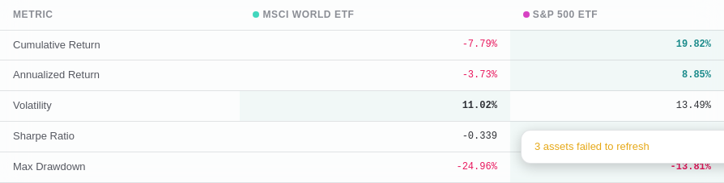
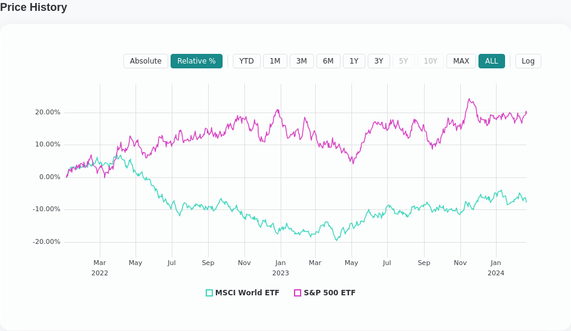
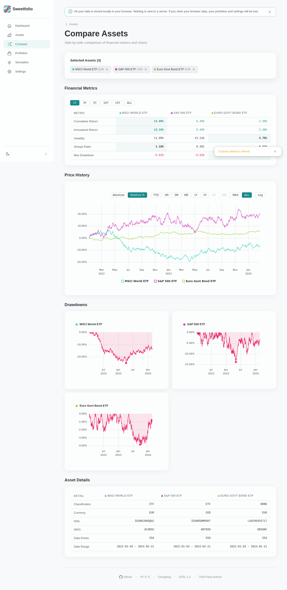
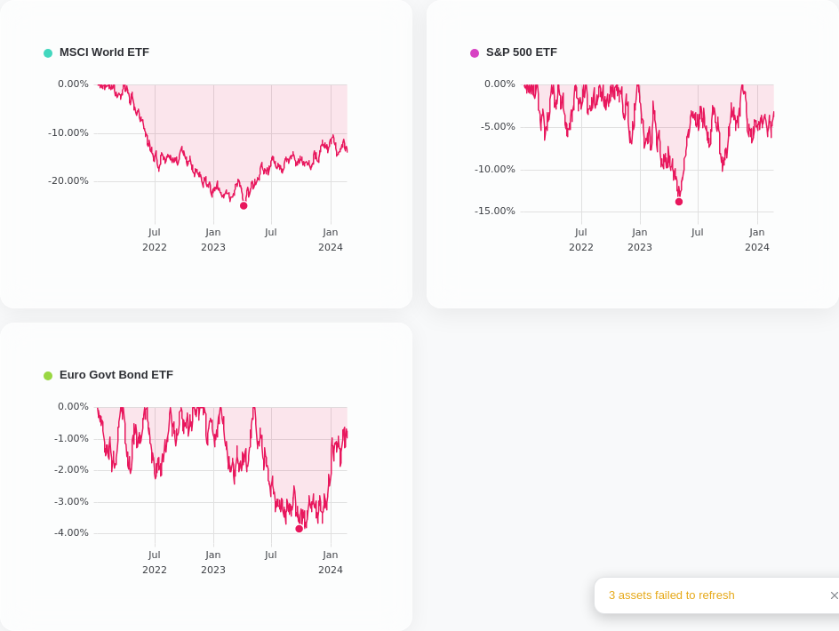

# Asset Comparison Feature — Demo Screenshots

These screenshots were auto-generated by Playwright (`e2e/compare-screenshots.spec.ts`).

## 1. Assets list with comparison checkboxes

## 2. Two assets selected — "Compare" button appears

## 3. Comparison page — full overview

## 4. Financial metrics table (close-up)

## 5. Overlaid price history chart

## 6. Three assets compared

## 7. Individual drawdown charts

